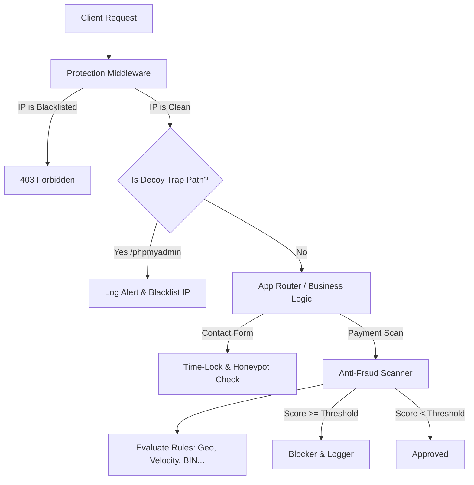

# 🛡️ SANANTI (v7.0.0) — Enterprise Active Deception & Anti-Fraud Security Shield

```
   _____  ____  _   _          _   _ _______ _____ 
  / ____|/ __ \| \ | |   /\   | \ | |__   __|_   _|
 | (___ | |  | |  \| |  /  \  |  \| |  | |    | |  
  \___ \| |  | | . ` | / /\ \ | . ` |  | |    | |  
  ____) | |__| | |\  |/ ____ \| |\  |  | |   _| |_ 
 |_____/ \____/|_| \_/_/    \_\_| \_|  |_|  |_____|
                                                   
   Enterprise Deception Defense & Real-Time Payment Guard for Go
```

**Sananti** is an enterprise-grade, thread-safe, active deception-defense (Honeytokens) and transaction anti-fraud scanning Go module. Built with high-performance memory cache & Redis distributed clusters, it enables pro-active defense against bots, crawlers, scanners, and payment fraud.

It features a premium, responsive multi-lingual dashboard (English, Kazakh, Russian) with dynamic configurations, real-time AJAX logs stream, GeoIP lookups, and Prometheus telemetry tracking.

---

## 🌍 Тілді Таңдау / Выбор Языка

* [English Documentation (EN)](#english-documentation)
* [Қазақша Нұсқаулық (KK)](#қазақша-нұсқаулық)
* [Русская Документация (RU)](#русская-документация)

---

<a name="english-documentation"></a>
## 🇺🇸 English Documentation

### Key Features
* 🛡️ **Threat Blockers**: Thread-safe memory and Redis blockers with auto-expiring TTLs and CIDR subnet whitelisting.
* 🍯 **Deceptive Decoy Honeytokens**: Lightweight middleware interceptors returning deceptive random codes (403/404) to trap scanners.
* 📨 **Invisible Honeypots & Cryptographic Time-Locks**: Bot prevention forms with HMAC speed-verification tokens.
* 💳 **Payment Scanner**: Risk scoring matching IP-Geo correlation, velocity checks, disposable domains, card BINs, and device fingerprints.
* 📊 **Telemetry**: Exposes scrapeable `/metrics` Prometheus counters.
* ⚙️ **Premium Multi-lingual Web UI**: Interactive settings control panel running on `:8081`.

### Core Architecture



### Quick Start Example
```go
package main

import (
	"log"
	"net/http"
	"time"
	"sananti/core"
	"sananti/middleware"
)

func main() {
	// Initialize memory blocker (falls back to Redis if needed)
	blocker := core.NewMemoryBlocker(1 * time.Hour)
	_ = blocker.GetWhitelist().Add("192.168.1.0/24")

	// Logger with rotation
	logger, _ := core.NewFileLogger("logs/alerts.log", 100, 5*1024*1024)

	// Honeytrap paths
	honeyTrap := middleware.NewHoneyTrap(blocker, logger)

	mux := http.NewServeMux()
	mux.HandleFunc("/", func(w http.ResponseWriter, r *http.Request) {
		w.Write([]byte("Safe content!"))
	})

	// Wrap with protection
	var handler http.Handler = mux
	handler = honeyTrap.HandleTrap("/phpmyadmin")(handler)
	handler = honeyTrap.ProtectionMiddleware()(handler)

	log.Println("Server running on :8080")
	http.ListenAndServe(":8080", handler)
}
```

---

<a name="қазақша-нұсқаулық"></a>
## 🇰🇿 Қазақша Нұсқаулық

**Sananti** — бұл Go тілінде жазылған, белсенді алдарқату (децепция) тұзақтары мен төлем транзакцияларының қауіпсіздігін тексеретін (анти-фрод) жоғары өнімді кітапхана.

### Негізгі Мүмкіндіктер
* 🛑 **Жылдам Бұғаттау**: Жадты және Redis кластерлерін қолдайтын, автоматты TTL мерзімі және CIDR желі асты ақ тізімдері бар қауіпсіз бұғаттаушы.
* 🍯 **Боттарға арналған тұзақтар**: Сканерлер мен боттарды бұғаттайтын алдарқату сілтемелері (`/phpmyadmin`, `/api/...`).
* 📨 **Жасырын өрістер мен Временной Замок**: Өтінімдерді миллисекундтық жылдамдықпен толтыратын боттарды HMAC криптографиялық токендерімен анықтау.
* 💳 **Анти-фрод сканер**: IP мен Карта шыққан елінің сәйкессіздігі, құрылғы таңбалары және транзакция жиілігін бағалау.

### Қалай іске қосамыз?
1. Жобаны іске қосыңыз:
   ```bash
   go run main.go
   ```
2. Браузерден ашыңыз: `http://localhost:8081/`
3. Оң жақ жоғарғы бұрыштан **KK** батырмасын басып, қазақша интерфейске ауысыңыз!

---

<a name="русская-документация"></a>
## 🇷🇺 Русская Документация

**Sananti** — это высокопроизводительная корпоративная библиотека на Go для проактивной защиты от кибер-угроз, сканеров ботов и мошеннических транзакций (анти-фрод).

### Основные Функции
* 🛑 **Потокобезопасный Блокировщик**: Поддерживает как локальную память, так и Redis, имеет авто-очистку по TTL и вайтлистинг CIDR подсетей.
* 🍯 **Honeytoken Ловушки**: Быстрый перехват сканеров по ложным путям с мгновенным занесением нарушителя в черный список.
* 📨 **Временные Замки и Скрытые Поля**: Эффективная защита форм обратной связи от авто-заполнения ботами через криптографические подписи HMAC.
* 💳 **Анти-фрод Сканирование**: Анализ платежей на основе лимитов, геолокации IP, лимита транзакций (velocity) и фингерпринтов.

### Локальный Запуск и Тесты
Запуск всех тестов:
```bash
go test -v ./...
```

Запуск сервера управления:
```bash
go run main.go
```
Откройте в браузере **`http://localhost:8081/`** для доступа к интерактивной панели управления на русском языке!

---

## 🛠️ Tech Stack & Structure
* **Backend**: Go (Golang) Standard Library, `go-redis`
* **Frontend**: Vanilla CSS, Modern HSL Gradients, Responsive Flex/Grid Layout
* **Monitoring**: Prometheus native text format
* **License**: MIT
